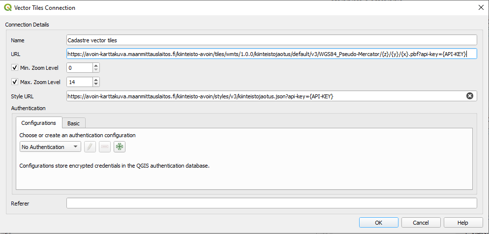
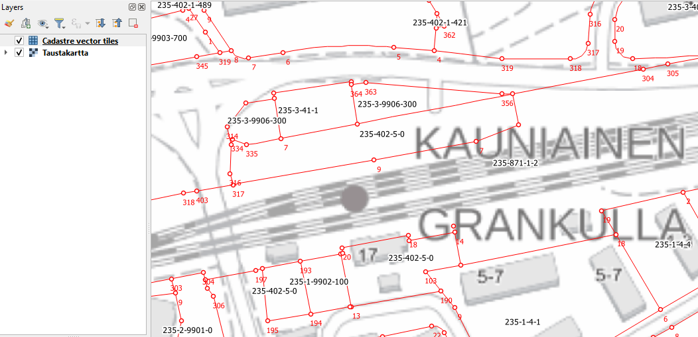
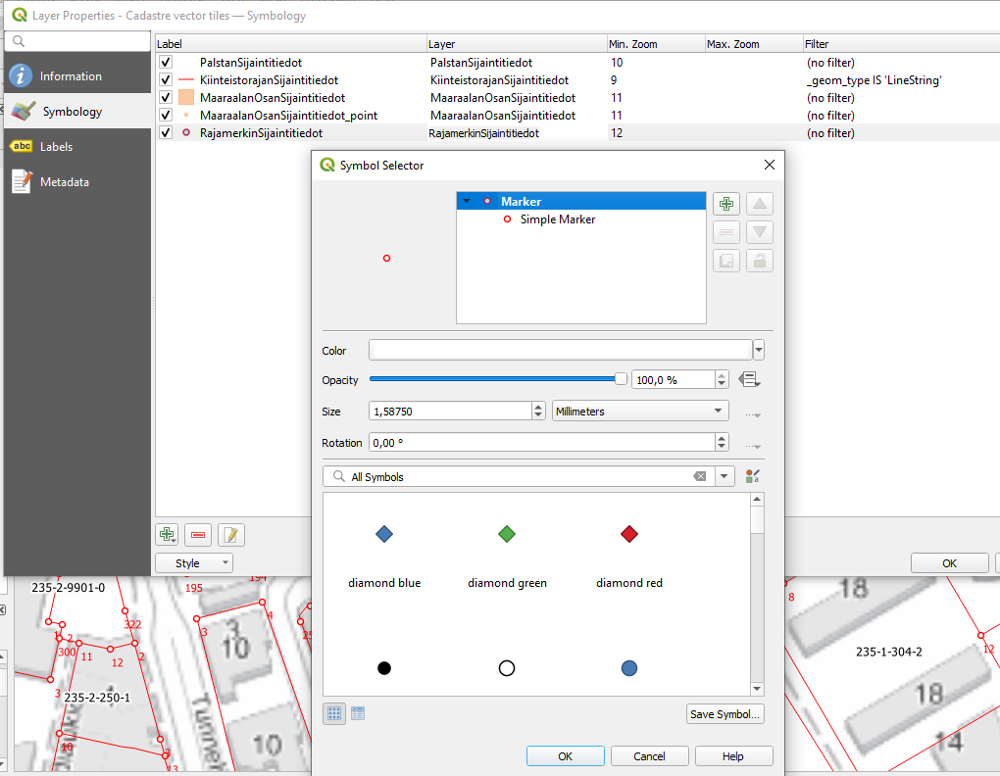

These instructions and screenshots are made by using QGIS 3.24.0-Hannover version.

Cadastre Vector Tiles service requires API-key to be funtional. Instructions how to create and get your own API-key can be found here (only in finnish): Information on how to get The API key for Open API services

<H2>Create connection</H2>

First user needs to create a new connection to the Vector Tile service. Right click a Vector Tiles icon or Vector tiles text on the left hand side window (Browser).

Select a New Generic Connection…

Type a name for the connection and add an address to the Vector tile service of Cadastral data. 

URL for Vector Tiles service is: 
https://avoin-karttakuva.maanmittauslaitos.fi/kiinteisto-avoin/tiles/wmts/1.0.0/kiinteistojaotus/default/v3/WGS84_Pseudo-Mercator/{z}/{y}/{x}.pbf?api-key={api-key}

National Land Survey of Finland has developed styles for QGIS. There are two different kinds of styles available for Cadastral data. One style is optimized for users who are using orthophotos or orthoimagery (Infrared) as a background map. Another style is designed to be used together with ordinary background maps. This style is loosely following the official styles of the property identifiers (Kiinteistötunnukset) and property boundaries (Kiinteistörajat) layers.

Style json address to be used together with orthophotos and orthoimagery (Infrared) background maps:

https://avoin-karttakuva.maanmittauslaitos.fi/kiinteisto-avoin/styles/v3/kiinteistojaotus_pelkistetty_ortokuva_pohjalla.json?api-key={api-key}

Style json address to be used together with ordinary topographic maps:

https://avoin-karttakuva.maanmittauslaitos.fi/kiinteisto-avoin/styles/v3/kiinteistojaotus_pelkistetty.json?api-key={api-key}

Click OK. Connection is made and user can drag and drop vector tile layers from Browser window to the main map window.

<H2>Modify symbology</H2>

User can check and modify symbology of the vector tiles in QGIS. Head to Layer Properties -> Symbology/Labels. Double click a layer and redesign the symbology.

