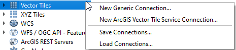
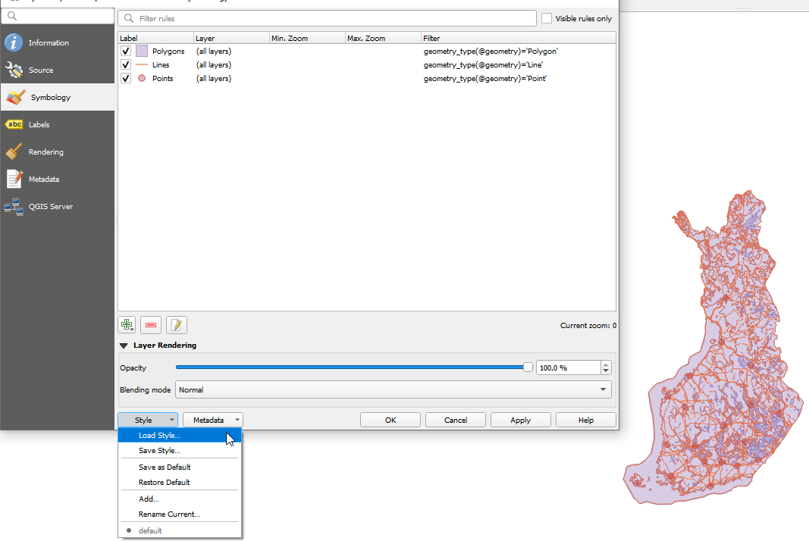

These instructions and screenshots are made by using QGIS 3.36.2 version.

Taustakartta Vector Tile service requires the API key to be funtional. [Instructioins for using the API key.](https://www.maanmittauslaitos.fi/en/rajapinnat/api-avaimen-ohje)

<H2>Create connection</H2>

First user needs to create a new connection to the Vector Tile service. Right click a Vector Tiles icon or Vector tiles text on the left hand side window (Browser).

Select a New Generic Connection…

Type a name for the connection and add an address to the Vector tile service of the background map. 

URL for the Vector Tiles service is: 
https://avoin-karttakuva.maanmittauslaitos.fi/vectortiles/taustakartta/wmts/1.0.0/taustakartta/default/v21/ETRS-TM35FIN/{z}/{y}/{x}.pbf?api-key={api-key}

Click OK. Connection is made and user can drag and drop vector tile layers from the Browser window to the main map window.

<H2>Use QGIS layer symbology</H2>

National Land Survey of Finland has developed style sheet file for the QGIS users . There are some minor differences between the symbology of WMS/WMTS services and vector tile services due to the technical differences of these services.

Select the qml file and click Load style button and Ok.

